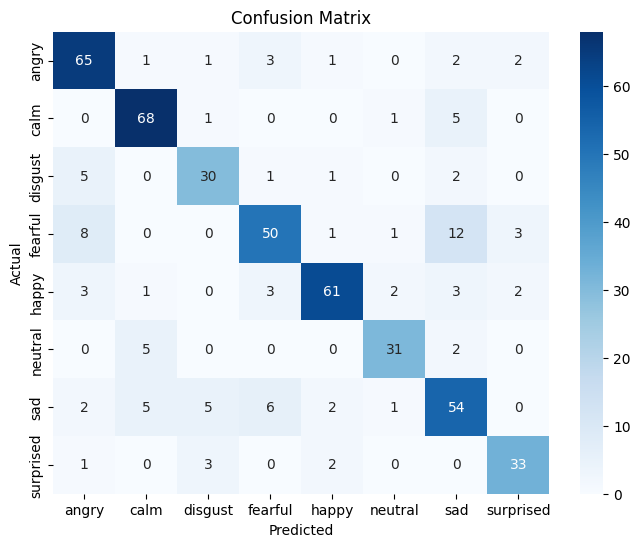

# Speech Emotion Classification

## Project Description

### Objective
The objective of this project is to design and implement a robust, end-to-end pipeline for emotion classification using speech and song data. The system leverages audio processing techniques and a deep learning model to accurately identify and categorize emotional states conveyed in audio recordings.

## Pre-processing Methodology

The audio data is transformed into a suitable format for the model through a series of pre-processing steps[1].

### 1. Data Loading and Structuring
- **Dataset**: The project uses the RAVDESS (Ryerson Audio-Visual Database of Emotional Speech and Song) dataset, which includes both speech and song files[1].
- **Label Extraction**: Emotion labels are extracted directly from the filenames. A mapping dictionary is used to convert the numeric emotion code in the filename (e.g., "01" for "neutral", "03" for "happy") into a string label[1].
- **Data Combination**: The file paths and corresponding labels for both speech and song are loaded into separate Pandas DataFrames and then concatenated into a single DataFrame. The combined data is shuffled to ensure randomness[1].
- **Class Distribution**: The initial dataset contains 8 emotion classes: `calm`, `sad`, `happy`, `angry`, `fearful`, `disgust`, `surprised`, and `neutral`. The classes are imbalanced, with `disgust`, `surprised`, and `neutral` having fewer samples[1].

### 2. Feature Extraction
Log-Mel Spectrograms are used as the primary feature for emotion classification. This is handled by the `compute_log_mel_spect` function[1].
- **Mel Spectrogram**: For each audio file, a Mel spectrogram is computed using `librosa.feature.melspectrogram` with `n_mels=128`, `hop_length=512`, and `n_fft=2048`[1].
- **Logarithmic Scaling**: The power spectrogram is converted to a logarithmic scale (decibels) using `librosa.power_to_db`, which better represents human perception of sound intensity[1].
- **Uniform Length**: To ensure consistent input size for the model, each spectrogram is padded with zeros or trimmed to a fixed length of `100` time steps[1].
- **Normalization**: The final log-Mel spectrogram is normalized by subtracting its mean and dividing by its standard deviation[1].

### 3. Data Preparation for Model Training
- **Data Reshaping**: The extracted features are compiled into a NumPy array `X` with a shape of `(samples, 128, 100, 1)`, where `1` represents the channel dimension[1].
- **Label Encoding**:
    - `sklearn.preprocessing.LabelEncoder` is used to convert the string labels into integer format.
    - `keras.utils.to_categorical` is then used to one-hot encode these integers, making them suitable for the model's `categorical_crossentropy` loss function[1].
- **Train-Test Split**: The dataset is split into training (80%) and testing (20%) sets using `sklearn.model_selection.train_test_split`. Stratification is applied to maintain the same class proportions in both sets[1].
- **Oversampling**: To address class imbalance, `imblearn.over_sampling.RandomOverSampler` is applied to the **training data only**. This technique randomly duplicates samples from the minority classes until all classes have an equal number of samples[1].

## Model Pipeline

A Convolutional Recurrent Neural Network (CRNN) is implemented for this task, combining the strengths of CNNs for feature extraction and RNNs for sequence modeling[1].

### Model Architecture
The model is built using Keras as a `Sequential` model:
1.  **CNN Block**:
    - `Conv2D` layer with 32 filters, (3,3) kernel, and 'relu' activation.
    - `BatchNormalization` layer to stabilize training.
    - `MaxPooling2D` layer with a (2,2) pool size.
    - A second block of `Conv2D` (64 filters), `BatchNormalization`, and `MaxPooling2D`[1].
2.  **Reshaping for RNN**:
    - The output from the CNN block is reshaped to prepare it for the RNN layers. A `Permute` layer is used to bring the time-step dimension to the front, followed by a `Reshape` layer to flatten the features for each time step[1].
3.  **RNN Block**:
    - `LSTM` layer with 128 units, returning sequences (`return_sequences=True`).
    - `Dropout` layer with a rate of 0.3 to prevent overfitting.
    - A second `LSTM` layer with 64 units.
    - `Dropout` layer with a rate of 0.3[1].
4.  **Output Layer**:
    - A `Dense` layer with 8 units (one for each emotion class) and a `softmax` activation function to output a probability distribution[1].

### Compilation and Training
- **Compiler**: The model is compiled with the `Adam` optimizer (learning rate of `0.0001`), `categorical_crossentropy` loss function, and `accuracy` as the evaluation metric[1].
- **Training**: The model is trained for 100 epochs with a batch size of 32 on the oversampled training data, using the original test set for validation[1].

## Accuracy Metrics

The model's performance was evaluated using accuracy on the training and validation sets during training[1].

- **Training Accuracy**: The model achieved near-perfect accuracy (approaching 1.0000) on the training data after about 30 epochs, indicating that it learned the training data patterns effectively[1].
- **Validation Accuracy**:
    - The validation accuracy shows how well the model generalizes to unseen data. It steadily improved during the initial epochs.
    - The peak validation accuracy was **81.26%** (at epoch 41)[1].
    - Towards the end of training (around epoch 50), the validation accuracy stabilized around **80%**[1].
    - The fluctuation in validation accuracy while training accuracy remained high suggests some degree of overfitting, which is common in deep learning models. Techniques like dropout were used to mitigate this[1].

For a more in-depth evaluation, metrics such as a **Confusion Matrix** and a **Classification Report** (including precision, recall, and F1-score for each emotion) would be beneficial.


**Confusion Matrix**


```Python
#Classification Report:
              precision    recall  f1-score   support

       angry       0.77      0.87      0.82        75
        calm       0.85      0.91      0.88        75
     disgust       0.75      0.77      0.76        39
     fearful       0.79      0.67      0.72        75
       happy       0.90      0.81      0.85        75
     neutral       0.86      0.82      0.84        38
         sad       0.68      0.72      0.70        75
   surprised       0.82      0.85      0.84        39

    accuracy                           0.80       491
   macro avg       0.80      0.80      0.80       491
weighted avg       0.80      0.80      0.80       491
```